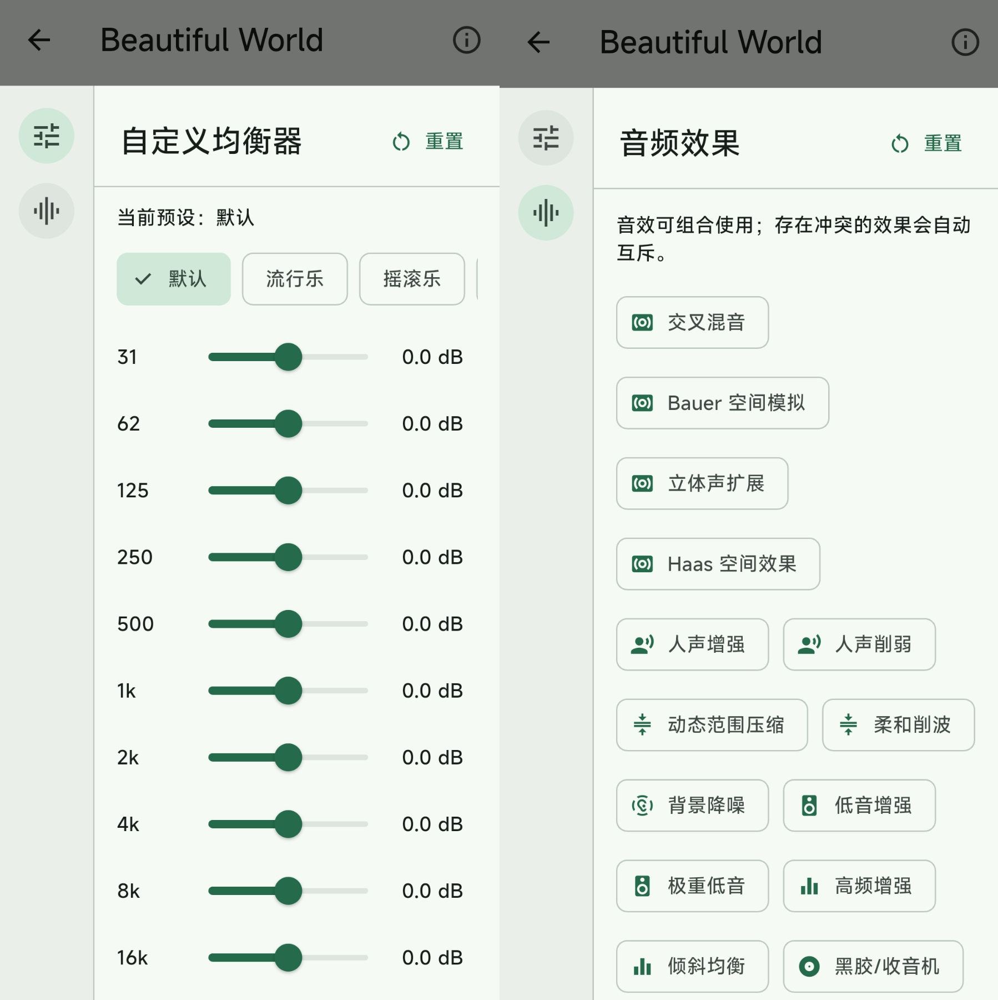
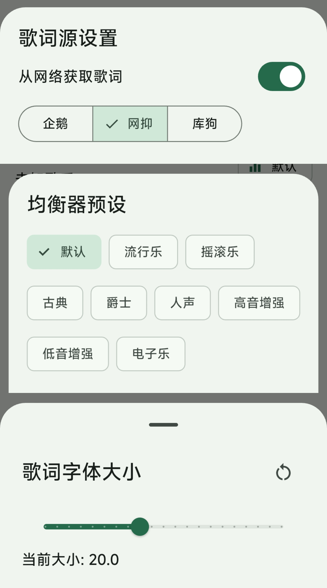
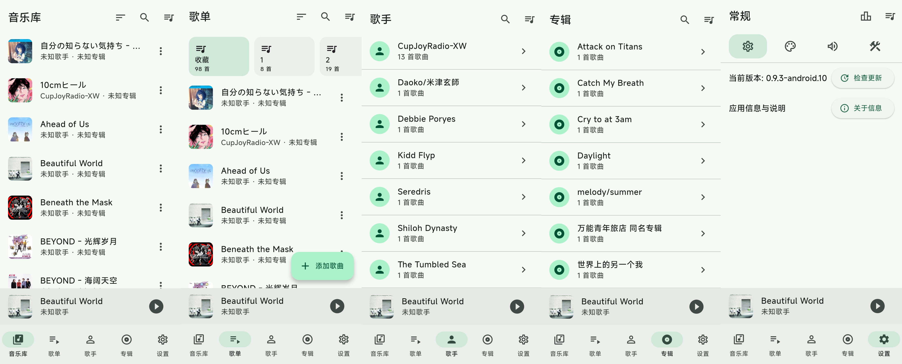

# 🎵 Myune music for Android

[](https://flutter.dev/)
[](#)

[](LICENSE)

一个基于 **Flutter (Dart)** 实现的 Android 本地音乐播放器。

> [!IMPORTANT]
> 本仓库是基于 [xiaobaimc/myune_music](https://github.com/xiaobaimc/myune_music) `0.9.3` 构建的 Android 移植与手机端适配版本，并非原项目官方 Android 发行版。原始项目与代码版权归原作者及贡献者所有；本项目继续遵循 [Apache License 2.0](LICENSE)。详细说明见 [ATTRIBUTION.md](ATTRIBUTION.md)。

## 💬 加入交流群

> [!TIP]
> 扫描下方二维码加入 **Myune music for Android 交流群**，交流使用经验、反馈问题或提出功能建议。

<p align="center">
  
</p>

## Android 端

Android 使用独立的触控界面：底部导航（音乐库、歌单、歌手、专辑、设置）、迷你播放条和全屏播放页，提供歌单、播放队列、播放模式、歌词解析/网络歌词、音调、倍速、均衡器、动态配色、统计和 ReplayGain 等功能：

* 支持 Android 通知栏播放器与耳机媒体按键
* 使用 Android 系统音频路由
* 使用 Dart 解析音频元数据，并保留文件名回退

首次添加歌曲时，应用会请求“音乐和音频”权限。Android 端可在 Flutter SDK 可用的环境中执行 `flutter pub get` 和 `flutter build apk --release` 构建。

> [!NOTE]
> 本仓库仅提供和支持 **Android** 版本。Windows/Linux 版本请前往 [Myune Music 源项目主页](https://github.com/xiaobaimc/myune_music) 下载。

## ✨ 特性
* 📱 仅支持 **Android**
* 🎶 歌曲管理：支持 **文件夹歌单** 与 **手动歌单**
* 🧠 自动按 **歌手** 与 **专辑** 分类
* 🎨 使用 [Material 3](https://m3.material.io/) 组件与配色
* 🎧 自动读取音频元数据，支持多种格式
* 📝 歌词支持：内嵌歌词、本地 `.lrc`、网络歌词源，支持本地逐字歌词
* 🔊 提供 **音调控制** 与 **倍速播放**
* 🔎 支持歌名、歌手、专辑、拼音及模糊匹配的 **智能搜索**
* 🎛️ 提供自定义均衡器、空间扩展、动态处理、音色修饰及人声修复等音效
* 📊 提供响度、电平、声场、频谱与频谱图 **实时音频分析**
* ↕️ 支持按歌曲名、文件名、歌手及修改日期排序，并优化同名歌曲去重
* 💬 提供跨页面的全局操作提示
* ✨ 可自定义主题配色与字体
* 🔔 支持 **Android 通知栏播放器** 与耳机媒体按键
* 🎵 读取使用和写入 **ReplayGain** 标签


## 🌐 歌词

目前仅支持UTF-8编码的 **.lrc** 文件

默认情况下，将会优先读取内嵌歌词，如果没有则读取本地 `.lrc` 文件

如果上述都无歌词的话，可以在设置中启用 **从网络获取歌词**

启用后，将在未读取到**内联歌词**和本地 `.lrc` 文件自动获取歌词

软件内默认提供了三个歌词源可供选择

实现参考 [通过歌曲名获取原文+翻译歌词](https://www.showby.top/archives/624)

### 🎵 歌词解析

假设有如下格式的歌词

>[02:55.031]照らされた世界 咲き誇る大切な人
>
>[02:55.031]在这阳光普照的世界 骄傲绽放的重要之人
>
>[02:55.031]te ra sa re ta se ka i sa ki ho ko ru ta i se tsu na hi to

可以看到这三句歌词对应的时间戳是相同的，那么软件内就会把它识别为同一句歌词的不同行

上述格式从上到下对应原文/翻译/罗马音

软件内提供设置`同时间戳歌词行数`，例如调整数值为2，最后一行（罗马音）就不会被显示

### 📃 逐字歌词

软件支持两种格式的逐字歌词：

>[00:15.237]悴[00:15.742]ん[00:15.908]だ[00:16.200]心

或者:

>[00:15.237]<00:15.237>悴<00:15.742>ん<00:15.908>だ

无需手动设置，软件会自动识别

## 📦 内嵌元数据支持

| 文件格式     | 元数据格式                     |
|-------------|------------------------------|
| AAC (ADTS)  | `ID3v2`, `ID3v1`             |
| Ape         | `APE`, `ID3v2`, `ID3v1`      |
| AIFF        | `ID3v2`, `Text Chunks`       |
| FLAC        | `Vorbis Comments`, `ID3v2`   |
| MP3         | `ID3v2`, `ID3v1`, `APE`      |
| MP4         | `iTunes-style ilst`          |
| MPC         | `APE`, `ID3v2`, `ID3v1`      |                        
| Opus        | `Vorbis Comments`            |
| Ogg Vorbis  | `Vorbis Comments`            |
| Speex       | `Vorbis Comments`            |
| WAV         | `ID3v2`, `RIFF INFO`         |
| WavPack     | `APE`, `ID3v1`               |

## 🎵 支持的音频格式

参阅 [media-kit](https://github.com/media-kit/media-kit#supported-formats)

> 部分格式需在设置启用 **允许添加任何格式的文件**


## 📸 软件截图

### 播放页：封面与歌词


### 自定义均衡器与音频效果



### 歌词源、均衡器预设与歌词字体大小

<p align="center">
  
</p>

### 音乐库、歌单、歌手、专辑与设置




## 🚀 快速开始

### 环境要求

* 安装 **Flutter SDK**，**Dart** 版本需 ≥ 3.10.0，**Flutter** 版本需 ≥ 3.41.0
* 安装 **Android SDK**

### 安装依赖

```bash
flutter pub get
```

### 启动项目

```bash
flutter run
```

### 构建项目
```bash
flutter build apk --release
```

## 🧱 使用的依赖与致谢

| 插件                                                                      | 功能             |
| ----------------------------------------------------------------------- | -------------- |
| [mpv_audio_kit](https://pub.dev/packages/mpv_audio_kit)                 | 音频播放与 Android 媒体控制 |
| [audio_metadata_reader](https://pub.dev/packages/audio_metadata_reader) | 音频元数据与内嵌封面读取 |
| [permission_handler](https://pub.dev/packages/permission_handler)       | Android 音频文件权限 |

更多依赖请查看 [pubspec.yaml](pubspec.yaml)。

特别感谢：

* [爱情终是残念](https://aqzscn.cn/archives/flutter-smtc)
* [Ferry-200](https://github.com/Ferry-200/coriander_player)

> 提供了 Rust + Flutter 的 SMTC 实现参考 🙏

## ❤️ 贡献

### 🧩 贡献
* 创建一个 [Issue](https://github.com/xiaobaimc/myune_music/issues)

可以是bug反馈，新功能请求，或者是某个地方的优化

* 创建一个 [Pull Request](https://github.com/xiaobaimc/myune_music/pulls)

可以是bug修复，添加新功能，或者是某个地方的优化

对于新功能的PR，请先创建一个 Issue 探讨该功能是否需要

## 📄 许可证

本项目使用 **Apache License 2.0** 开源许可协议。
详细内容请查看根目录下的 [LICENSE](/LICENSE) 文件。

## 🔤 字体版权说明（Font License）

本项目使用小米公司提供的 **MiSans 字体**，该字体已明确允许**免费商用**。

* 字体版权归小米公司所有
* 相关许可协议请查阅：[MiSans 字体知识产权使用许可协议](https://hyperos.mi.com/font-download/MiSans%E5%AD%97%E4%BD%93%E7%9F%A5%E8%AF%86%E4%BA%A7%E6%9D%83%E8%AE%B8%E5%8F%AF%E5%8D%8F%E8%AE%AE.pdf)
* MiSans 官网：[https://hyperos.mi.com/font/](https://hyperos.mi.com/font/)

## Star History Chart

[](https://star-history.com/#xiaobaimc/myune_music&Date)
