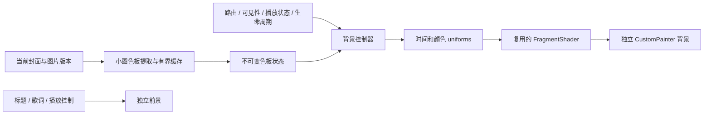

# Myune Music for Android：流体色彩背景完整实施规划

版本：1.0 · 2026-09-09 · 状态：规划，尚未实施产品功能。

本文件中的时长、缓存上限和性能数值是开发起点与验收目标，不是已经实现的性能承诺。执行时先核查当前代码、Flutter SDK、设备和已有修改。

## 1. 产品目标与范围

实现跟随歌曲封面配色、缓慢交融、过渡连续的动态背景，同时改善已有的主页进入播放页卡顿。用户应当先得到即时反馈，再看到背景流动；歌词和播放控制优先于背景动画。

推荐路线：单个 FragmentShader 生成柔和色团与轻量扭曲，由独立控制器更新参数，通过 CustomPainter 绘制。不做真实流体求解，不在首版引入原生渲染插件、WebView、视频循环、多遍反馈纹理或每帧 CPU 生成图片。

首版包含：

- 播放页「流体色彩」可选背景，覆盖封面视图和歌词视图的共用背景层。
- 封面色板提取与缓存、快速切歌时的连续颜色交接。
- 路由、播放状态、前后台、减少动态效果和质量档位控制。
- 静态渐变降级；旧背景模式和原设置继续可用。
- 逐帧性能采集、真实设备验证、资源清理和回滚路径。

首版不包含：主页全局动态背景、节拍/FFT 响应、触摸搅动、物理流体、液态玻璃折射、复杂粒子、自动更换用户现有背景。这些只在首版性能与功耗验收后单独评估。

## 2. 已有证据及其适用范围

诊断报告：[真机诊断](F:/AGENT/1/test-artifacts/entry-jank-20260909/final-diagnosis.md)。原始数据在同目录。

- 当时 SDK 为 Flutter 3.44.9，设备为 vivo V2352A / Android 15，Impeller/Vulkan，采样时渲染刷新率约 60Hz。
- 页面进入的 build 峰值约 28–35ms，CPU 采样主要落在组件挂载和更新，未归因到唯一业务函数。
- 原效果末尾复测：进入 raster P95 18.91ms，最大 26.32ms，10/93 帧超过 16.67ms。
- 仅关闭面板毛玻璃：进入 raster P95 12.52ms，最大 15.45ms，0/94 超预算。
- 同时关闭背景模糊和面板毛玻璃：进入 raster P95 10.55ms，最大 13.09ms，0/94 超预算；build 仍可到 34.25ms。
- 单独延迟背景挂载、删除整页淡入或删除 Hero 均未解决全部问题。
- 首次出现图片准备、字形图集和图形管线创建成本，但异步事件跨度不能直接算成 UI 同步阻塞。

这些是小样本、非随机顺序的诊断结果。执行时重新测量，不能假定后续版本、所有歌曲或所有设备都一致。

## 3. 用户体验规范

### 3.1 视觉

- 从封面提取 3–5 个稳定代表色，剔除大量透明像素和不适合作为主体的极端噪点；纯黑白封面使用低饱和主题回退色。
- 首版使用约 4 个柔和色团；高质量档最多增加到约 6 个。色团缓慢漂移，轻量坐标扭曲产生交融感。
- 色团本身生成柔软边界。流体模式不再叠加已有全屏高斯模糊，也不默认叠加控制面板实时 BackdropFilter。
- 在 shader 内控制亮度、饱和度和暗角，前景面板用半透明填充及细边框。必要的文字遮罩保留，但避免全屏透明层不断叠加。
- 保持文字区域亮度稳定。对歌词、标题和主要控件进行明暗封面、动画不同相位的对比度检查；普通正文以至少 4.5:1 为设计目标。
- 首版不每帧加随机颗粒；若存在色带问题，再比较微弱静态噪声与不加噪声的成本。

### 3.2 初始调参范围

| 参数 | 初始值/范围 | 说明 |
|---|---|---|
| 色团数量 | 默认 4，高档至多 6 | 先固定数量，避免无界循环 |
| 主要运动周期 | 15–30 秒量级 | 运动连续，避免所有色团同步往返 |
| 切歌曲色板过渡 | 700–1200ms | 从当前显示色板继续，不重新从旧歌曲起点播放 |
| 流动启动/停止速度过渡 | 150–250ms | 减少突然开始/停止感；不可见时立即停止调度 |
| 背景更新 | 默认尝试 30Hz | 按屏幕 vsync 的整数分频优先，如 60→30、120→30 |
| 高质量 | 最高 60Hz 请求更新 | 实测通过后开放；不追随 120/144Hz 无限制绘制 |

上述数值集中在配置对象，避免散落 magic number。低频运动不代表必须低帧率；实际观感与帧耗时共同决定档位。

### 3.3 设置与兼容

- 复用现有播放页背景设置入口，新增加「流体色彩」选项。
- 旧用户升级后继续使用原模式。新字段缺失、枚举未知或 shader 加载失败时安全回退。
- 可提供「自动 / 省电 / 流畅」质量选项；首版用户控件保持精简，默认自动。
- 自动模式遵守减少动态效果：启用时呈现静态渐变。是否响应系统省电状态先核查现有平台能力，无法读取时使用应用内明确设置，不伪造系统状态。
- 流体模式隐藏无意义的“背景高斯模糊强度”控制，保留旧模式该参数的值和含义，不静默改写。
- 功能开关/模式切换只影响显示，不改变队列、音频、播放位置、统计、权限或用户封面文件。

## 4. 技术架构

### 4.1 模块建议

文件名可随项目组织调整，职责不要挤入已经较大的 mobile_shell.dart。

| 建议文件 | 责任 |
|---|---|
| `lib/widgets/playback_background/playback_background.dart` | 背景模式选择与前景组合，复用旧背景实现 |
| `lib/widgets/playback_background/fluid_background.dart` | shader 生命周期、CustomPaint、背景重绘边界 |
| `lib/widgets/playback_background/fluid_background_painter.dart` | 设置 uniforms 和一次矩形绘制 |
| `lib/services/fluid_background_controller.dart` | 有效时间、颜色交接、质量与运行状态 |
| `lib/services/artwork_palette_cache.dart` | 小图采样、任务合并、版本校验、有界缓存 |
| `lib/models/fluid_background_state.dart` | 色板、状态、质量配置等不可变数据 |
| `shaders/fluid_background.frag` | 单遍流体观感 shader |
| 现有 settings provider / 播放页设置 | 默认值、迁移、模式和质量选项 |

执行前查找已有取色、缓存和生命周期实现，能复用就不新建平行系统。文件列表不是要求机械创建全部抽象。

### 4.2 渲染契约

- shader 在 pubspec.yaml 的 `flutter.shaders` 中声明，使用 `FragmentProgram.fromAsset` 加载。
- FragmentProgram 可缓存；每个独立渲染实例持有自己的可变 FragmentShader，跨帧复用并正确释放。
- 每帧只更新少量数值：尺寸、有效时间、固定数量色团参数、当前混合色板、亮度/运动强度。避免每帧列表分配、图片解码、资源加载和全页 notifyListeners。
- 使用 CustomPainter 的 repaint Listenable 驱动绘制，不通过页面 setState 驱动背景帧。
- 前景和背景分开重绘。RepaintBoundary 只用于隔离，不当作每帧背景自动缓存或 GPU 免费复用的保证。
- 默认不需要 ImageFilter.shader：目标是直接生成背景，不是读取已有页面再滤镜处理。
- 声明 uniforms 的顺序与 Dart 写入索引保持一致；对尺寸变化、透明度预乘、颜色空间、NaN/Inf、长时间运行的浮点精度进行检查。
- 时间可有界化，但必须在 shader 运动周期上连续衔接，不能用简单取模制造可见跳变。

### 4.3 色板与切歌契约

- 优先复用已有小图/取色结果。需要新采样时以约 32×32 或 64×64 小图作为起点；重计算按测量决定是否交给长期 worker isolate。
- 不把 ui.Image 跨 isolate 传递；需要工作线程时只传可传输像素数据/字节和简单参数。
- 色板缓存建议最多 64 条，键包含封面稳定标识与内容版本；路径相同而封面被替换必须失效。
- 同一图片的并发请求合并。序号/代际标识验证结果，A→B→C 快速切换时 B 的迟到结果不能覆盖 C。
- 最多保留当前显示色板、目标色板及必要的小量相邻缓存。网络取封面等待期间不长期占用交互调度租约。
- 中断颜色过渡时，从当前已经混合出的显示颜色继续插值，保持位置和运动相位连续。
- 固定颜色槽位并做稳定排序/匹配，避免色板顺序变化引起色团无意义翻转。基础版可用简单、可解释的亮度/色相匹配；复杂感知插值留待视觉测试需要时加入。
- 没有封面、损坏图片或任务失败时使用稳定主题渐变，不闪白、不显示上一首错误封面。

## 5. 运行状态与调度

### 5.1 状态优先级

`disposed > 不可见/非 resumed > 用户关闭或减少动态效果 > 路由过渡/关键交互 > 资源未就绪 > 暂停播放 > 正常流动`。

| 状态 | 显示 | 后台工作 | 调度行为 |
|---|---|---|---|
| 未选流体模式 | 原背景 | 不初始化昂贵流体资源 | 无背景 ticker |
| 待资源 | 静态主题/已有色板 | 合并、限量准备 | 不启动持续动画 |
| 页面进入 | 固定相位/静态回退 | 非必要工作等待安全时机 | 冻结流动 |
| 页面稳定且播放 | 流动色彩 | 仅响应新的色板目标 | 有界更新 |
| 暂停播放 | 平滑停在当前相位 | 可接受一次色板完成更新 | 停止持续 ticker |
| 返回手势开始 | 保持当前相位 | 丢弃无关任务 | 冻结；取消返回后可恢复 |
| 不可见/后台/锁屏 | 不绘制 | 取消或忽略过期结果 | 无周期任务 |
| Shader 失败/减少动态效果 | 静态渐变 | 本次会话避免重复失败重试 | 无持续 ticker |

进入完成由路由动画状态决定，不以固定 Timer 假定。手势返回被取消、路由被弹窗覆盖、快速进退也需要状态转换测试。

通知栏展开产生 inactive 时，可以暂停流体更新，但不要修改全局音频前后台判定。当前 foreground_lifecycle.dart 特意区分失焦和后台；视觉策略可更保守，不能破坏现有播放恢复语义。

### 5.2 接入现有交互控制

当前 InteractionPerformanceController **没有 UI Listenable**，提供 isCritical、waitForIdle、acquireIdleWork 等接口。不能假定它可被 Provider.watch，也不要为背景每帧增加全页通知。

- route 状态和后台状态直接通知背景控制器；其他关键交互可通过小范围事件接入。
- 背景已经运行时可在自身现有 tick 中检查 isCritical；停止后通过已有事件或单个可取消等待恢复，不新增永久轮询器。
- `waitForIdle` 超时返回不等于真正空闲；唤醒后重新检查实际条件。
- 非必要重任务优先使用 acquireIdleWork，检查 lease.isGranted，使用 try/finally release，附带 isStillNeeded 代际判断。
- 当前队列不提供直接删除请求的句柄时，至少让过期请求失效并合并重复请求，避免退出页面后队列堆积。
- 路由完成、图片就绪和恢复前台同时发生时，不能在同一帧启动取色、背景首绘、歌词效果和全部装饰动画。

## 6. 缓存、质量与资源预算

### 6.1 默认先做单遍 shader

先测直接绘制的低复杂度 shader。如果性能足够，不引入离屏管线。图案细节减少、色团减少、暂停不可见工作通常应先于原生纹理改造。

### 6.2 更新频率与自适应

- 用 vsync 时间戳和节流通知控制背景请求更新频率，不依靠 Timer.periodic 做渲染节拍。
- 30Hz 参数更新不保证背景 GPU 开销减半；前景动画或毛玻璃可能让背景参与更多次合成，必须测量。
- 自动降级优先顺序：减少噪声/扭曲复杂度 → 减少色团 → 降低请求更新频率 → 静态。
- 使用持续窗口而非单帧峰值降级。可从至少 2 秒稳定可见窗口开始，降级后至少维持 10 秒，持续稳定约 30 秒才考虑升一级；过滤启动、路由和失焦窗口。数值需实测调整。
- 整页变慢未必由背景引起。只能保守降级，不把整页 FrameTiming 宣称为纯背景 GPU 计时，不把其他页面负载写入永久低质量设置。
- 自适应性能采样为低频聚合、有界缓冲、无每帧日志；release 是否启用取决于测得的监控开销。

### 6.3 可选后续离屏优化

只有证明确实受像素填充/片元运算限制时，才研究真正的小尺寸 GPU 离屏纹理，再放大合成。

- 小 Widget + Transform.scale 不保证减少实际片元数量。
- 禁止每帧 toImage/toByteData、CPU 截图或纹理回读方案作为默认动态管线。
- 低分辨率纹理路径可能需要额外 GPU API/插件，属于单独阶段，先验证兼容性与真实收益，再引入依赖。
- 若生成静态回退快照，只允许在有限的资源/状态转换中生成并缓存；估算 width×height×4 的基础内存并考虑纹理和中间副本，不能只看 Dart 堆。
- 起始预算：色板最多 64 条；流体不持有额外完整封面副本；新加入静态背景位图缓存软上限 16MiB，按设备与峰值测量调整。低内存时清理非当前资源。

## 7. 分阶段实施与验收关口

| 阶段 | 工作 | 必须交付 | 进入下一阶段条件 |
|---|---|---|---|
| P0 基线与保护 | 读取仓库规则、记录 Git 状态、复现原问题、保存版本和设置 | 基线报告、可重跑采样脚本 | 清楚区分 build/raster、冷/热和进入/返回 |
| P1 现有卡顿优化 | 缩减首帧挂载/主页无关更新，验证滤镜简化或静态缓存 | 原背景模式的独立改动与 A/B 数据 | 关键交互和旧外观无明显回归；首帧问题量化 |
| P2 独立背景原型 | 固定色板单 shader、独立 painter、静态回退 | 可运行实验入口、固定相位截图、独立耗时 | 不驱动前景逐帧 rebuild；无每帧资源分配问题 |
| P3 播放页集成 | 色板缓存、切歌交接、生命周期、路由状态 | 可用流体模式、竞态与资源释放测试 | 快进快退/切歌/后台恢复正确；旧模式默认不变 |
| P4 质量与设置 | 精简设置、减少动态效果、质量档位与保守降级 | 设置迁移测试、降级记录 | 低档位有效减负；隐藏时停止工作 |
| P5 真机验收与交付 | 冷/热、歌词、长时和资源验证，release 冒烟 | 实现说明、数据、构建产物、已知限制、回滚说明 | 达到目标或明确保持功能默认关闭并记录剩余问题 |

各阶段可以连续执行，不要求每阶段等待确认。真实外部依赖、设备授权或破坏性操作阻塞时说明具体问题。性能不足时继续定位，不通过放宽阈值或删除功能声称验收通过。

P1 与流体模式分离，方便判断收益来源；不要求先把所有旧背景路径彻底重写成新系统。流体原型可在现有问题量化后开展，但产品发布不能用新模式掩盖旧模式回归。

## 8. 测试与性能目标

### 8.1 功能测试

- 色板缓存命中、替换封面失效、无效图片回退。
- A→B→C 结果乱序、dispose 后完成、暂停/恢复期间切歌，最后选择始终生效。
- 进入/返回/取消返回、覆盖页面、inactive/resumed、hidden/paused，状态与 ticker 一致。
- 质量档位迟滞与上限，旧设置迁移，未知模式值回退。
- shader 失败后可播放、可返回、可切设置；不重复创建失败任务。
- 只对实际行为写测试，不用“源码包含某字符串”代替功能验证。测试数量与风险匹配。

### 8.2 真机矩阵

| 场景 | 建议样本 | 重点 |
|---|---|---|
| 进程重启后的首次进入 | 至少 5 次独立进程 | 单独报告 OS/驱动缓存未清除；不称为磁盘全冷 |
| 同歌曲重复进入/返回 | 各至少 20 次 | 分批 A/B/A 或交替顺序，记录每次结果 |
| 切歌立即进入 | 至少 10 次、多种封面 | 色板、精确封面准备、路由负荷冲突 |
| 快速连续切歌、快速进退 | 至少 10 组 | 无旧色覆盖、无泄漏、音频持续正确 |
| 流体 + 封面页播放 | 连续至少 2 分钟 | 稳态帧耗时和 CPU/GPU 活动 |
| 流体 + 歌词滚动/拖动进度 | 至少 2 分钟 | 前景优先，交互降级正确 |
| 后台/锁屏/通知栏恢复 | 每类至少 5 次 | 隐藏时无持续背景 tick，恢复不跳相位 |
| 长时播放 | 至少 15 分钟 | 温升、功耗代理指标、Dart/native/GPU 内存趋势 |

优先当前 vivo 真机，并争取另一台较低性能设备。设备不具备时明确标记未测；不通过后台模拟器结果宣称所有 Android 设备通过。高刷新率和其他后端能测则测，不能测则保持限制说明。

保持音轨、音频状态、亮度、刷新率、热状态、截图/录屏开销等条件尽量一致。长时功耗比较在相同充电状态下进行；充电电流受充电策略影响，不能当作应用功耗。

### 8.3 初始验收目标

令 B=1000/实际渲染刷新率(ms)。以下用于目标设备；遇到平台限制应记录，不静默改成“已通过”。

- 稳态整页 build P95 ≤0.5B，raster P95 ≤0.75B；60Hz 时约 8.3ms / 12.5ms。
- 稳态 build 或 raster 超 B 的帧比例各争取 <1%，并报告 P99/max；不包含空闲不出帧时间。
- 进入/返回单独报告全窗口和首帧。争取无 >50ms 的 build/raster 帧，重复进入首次 build 争取 ≤B；达到困难时记录剩余峰值及原因，流体仍保持可选。
- 对比“已优化的静态背景”，整页 raster P95 的增加争取 ≤min(3ms,0.2B)。这是 A/B 分布差异目标，不是纯背景 GPU 计时，也不能把两个 P95 的差当作精确耗时归因。
- 流体 tick 不触发页面根、歌词列表、控制面板的逐帧 build/layout；播放进度和歌词本来的更新不算背景引发。
- 隐藏/锁屏后流体 ticker 和周期取色工作停止；后台音频不受影响。
- 重复进入/退出和切歌后，shader/image/监听器数量不单调增长；给出热身后与清理后的内存趋势，不要求 GPU 驱动缓存立即归零。
- 保留首次资源创建峰值、末帧恢复峰值和异常样本，不能只挑稳态好看的窗口。

性能使用 profile 构建与 FrameTiming；release 做视觉与功能复核。详细 Widget 追踪/CPU 采样用于归因，其额外开销必须标注，不与未增强追踪样本混排。

## 9. 风险与处理

| 风险 | 处理 |
|---|---|
| 首次 shader 加载后仍有首绘峰值 | 分开测加载与首绘；有限预准备和静态回退，不依赖 Offstage 自动预热 |
| 背景流动让毛玻璃每帧变贵 | 流体模式默认使用半透明面板，不沿用原高成本滤镜栈 |
| 低帧率节流没有降低 GPU 工作 | 记录真实帧、合成和功耗；先降低复杂度，不宣称固定减半 |
| 快速切歌的旧任务返回 | 代际校验、合并、丢弃过期结果、释放租约 |
| 跨平台或后端不支持/实现不同 | 使用公开 API、运行时回退；不默认要求 ImageFilter.shader |
| 页面结束后仍在 tick | 单一资源所有者、明确 dispose、监听器对称解绑 |
| 旧模式或旧设置回归 | 默认保持原选择，分离改动，独立回归测试 |
| 移动背景影响歌词阅读 | 稳定亮度、低振幅、减少动态效果、静态模式 |

## 10. 交付与完成定义

交付源代码、必要 shader 资产、行为测试、性能采集脚本、前后对比表、可用构建产物路径、设置迁移说明和已知限制。报告区分“已实现 / 已真机验证 / 未测”。

不得在产品中残留临时 VM 调试开关、逐帧日志、测试歌曲操作或全局性能开关。既有用户修改不能被 reset/checkout 覆盖；临时源码备份恢复前核对文件是否被他人修改。

真机安装前保留可恢复的当前包，覆盖安装保留数据；手机提示由用户确认，不绕过系统安装授权。不能因签名冲突或版本问题擅自卸载/清数据。仅用于诊断的包结束后恢复；最终产品包是否保留按当前用户指示执行。

首版完成表示端到端功能和已声明的验收完成，不是仅展示 shader demo。未达到性能关口时保持默认关闭并明确说明，不能宣称卡顿完全解决。

## 11. 技术参考

- Flutter 自定义 shader、Paint.shader、跨帧复用：[Writing and using fragment shaders](https://docs.flutter.dev/ui/design/graphics/fragment-shaders)。
- repaint Listenable 绕过 build/layout：[CustomPainter](https://api.flutter.dev/flutter/rendering/CustomPainter-class.html)。
- profile 采样及 UI/raster 区分：[Performance view](https://docs.flutter.dev/tools/devtools/performance)。
- ImageFilter.shader 的后端限制：[API 文档](https://api.flutter.dev/flutter/dart-ui/ImageFilter/ImageFilter.shader.html)。本方案默认不依赖该 API。

公开文档可能对应比本地更新的 SDK。实现时以当前本地 SDK 声明和真机行为为准，发现不一致应记录并选择兼容路径。
